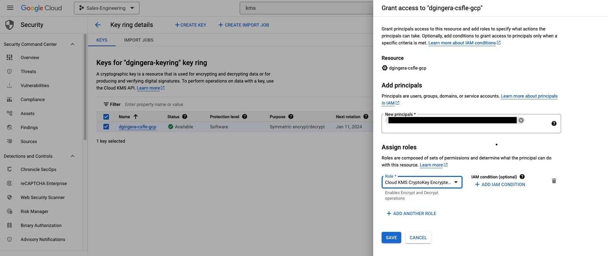
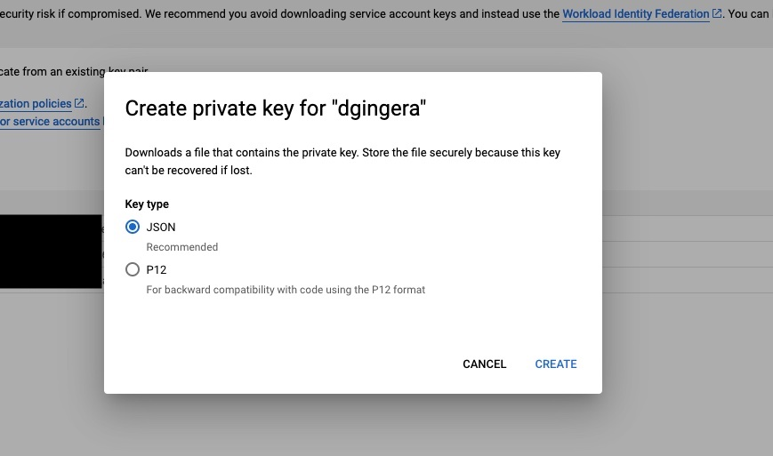

# Client-Side Field Level Encryption (CSFLE) with Google KMS

This repository provides a step-by-step demo of the Confluent Cloud feature [Client-Side Field Level Encryption](https://docs.confluent.io/cloud/current/clusters/csfle/overview.html).

## Prerequisites

* Confluent Cloud cluster with Advanced Stream Governance package
* For clients, Confluent Platform 7.4.5, 7.5.4, 7.6.1 or higher are required.

## Goal

We will produce personal data to Confluent Cloud in the following form 
```
{
    "id": "0",
    "name": "Anna",
    "birthday": "1993-08-01",
    "timestamp": "2023-10-07T19:54:21.884Z"
}
```
However, we set up the corresponding configurations to encrypt the `birthday` field.
We then start a consumer with the corresponding configurations to decrypt the field again.

In order to have a realistic scenario, we do not produce and consume via the CLI but develop a
producer and consumer application with Kotlin.

## Create Tag

We first need to create a tag on which we apply the encryption later, such as `PII`.
As of today, we need to create the tag in the Stream Catalog first, see the [documentation](https://docs.confluent.io/platform/current/schema-registry/fundamentals/data-contracts.html#tags) of Data Contracts.

## Google KMS

Create a Key Ring and add a key to it. Copy the key's resource name as shown.


:warning: **Important:** Ensure you grant your Service Account the `Cloud KMS CryptoKey Encrypter/Decrypter` role on the Google KMS key you just created. Otherwise you will not be able to use the key to Encrypt/Decrypt your data!



## Download Service Account Credentials

Download the JSON credentials file for the service account you'd like to use (If you don't already have one, just create a new Key in JSON format and it will automatically be downloaded to your computer). 

You will use the content found here in the Producer/Consumer properties files for `client.id`, `client.email`, `private.key.id`, and `private.key`




## Register Schema

We register the schema with setting `PII` to the birthday field and defining the encryption rule

```shell
curl --request POST --url 'https://psrc-d0vxy.ca-central-1.aws.confluent.cloud/subjects/dgingera-csfle-demo-value/versions'   \
  --header 'Authorization: Basic <base64 encoded SR Key:Secret>' \ 
  --header 'content-type: application/octet-stream' \
  --data '{
            "schemaType": "AVRO",
            "schema": "{  \"name\": \"PersonalData\", \"type\": \"record\", \"namespace\": \"com.csfleExample\", \"fields\": [{\"name\": \"id\", \"type\": \"string\"}, {\"name\": \"name\", \"type\": \"string\"},{\"name\": \"birthday\", \"type\": \"string\", \"confluent:tags\": [ \"PII\"]},{\"name\": \"timestamp\",\"type\": [\"string\", \"null\"]}]}",
            "metadata": {
            "properties": {
            "owner": "Dan Gingera",
            "email": "dgingera@confluent.io"
            }
          }
    }' 
```
## Register Rule

```shell
curl --request POST --url 'https://psrc-d0vxy.ca-central-1.aws.confluent.cloud/subjects/dgingera-csfle-demo-value/versions' --header 'Authorization: Basic <base64 encoded SR Key:Secret>' --header 'Content-Type: application/vnd.schemaregistry.v1+json' \
  --data '{
        "ruleSet": {
        "domainRules": [
      {
        "name": "encryptPII",
        "kind": "TRANSFORM",
        "type": "ENCRYPT",
        "mode": "WRITEREAD",
        "tags": ["PII"],
        "params": {
           "encrypt.kek.name": "dgingera-csfle-gcp",
           "encrypt.kms.key.id": "<GCP Key ID>",
           "encrypt.kms.type": "gcp-kms"
          },
        "onFailure": "ERROR,NONE"
        }
        ]
      } 
    }'
```

We can check that everything is registered correctly by either executing
```shell
curl --request GET --url 'https://psrc-d0vxy.ca-central-1.aws.confluent.cloud/subjects/dgingera-csfle-demo-value/versions/latest' --header 'Authorization: Basic <base64 encoded SR Key:Secret>' | jq
```

or in the CC UI


## Producer configuration

### Gradle
We need to add
```shell
implementation("io.confluent:kafka-avro-serializer:7.5.1")
implementation("io.confluent:kafka-schema-registry-client-encryption-gcp:7.5.1")
```

### Producer
We need to adjust the configuration by adding
```kotlin
// Encryption + GCP Creds (Note: All credential info can be found in your Service account's credential JSON file we downloaded in the earlier step)
settings.setProperty("rule.executors._default_.param.client.id", "<GCP Client ID>")
settings.setProperty("rule.executors._default_.param.client.email", "GCP Client Email")
settings.setProperty("rule.executors._default_.param.private.key.id", "<GCP Private Key ID>")
settings.setProperty("rule.executors._default_.param.private.key", "<GCP Private Key Material>")

// Required since we manually create schemas
settings.setProperty("use.latest.version", "true")
settings.setProperty("auto.register.schemas","false")
```

We continuously produce data with the encryption (the topic `dgingera-csfle-demo` needs to be created before) by executing
```
./gradlew run
```

We can see in the logs that everything is working fine
```shell
11:17:33.077 [Thread-0] INFO  KafkaProducer - Kafka Producer started
11:17:34.495 [kafka-producer-network-thread | producer-1] INFO  KafkaProducer - event produced to dgingera-csfle-demo
11:17:36.665 [kafka-producer-network-thread | producer-1] INFO  KafkaProducer - event produced to dgingera-csfle-demo
```

or check the encrypted field messages in the CC UI


## Consumer

Update the Consumer properties file with the same Confluent Cloud cluster, Schema Registry, and GCP credentials you used for the producer and re-run.
```
./gradlew run
```

It may take a few seconds but then we can see all events with decrypted `birthday`
field:

```shell
[main] INFO  KafkaConsumer - We consumed the event {"id": "0", "name": "Anna", "birthday": "1993-08-01", "timestamp": "2023-10-07T20:48:02.624Z"}
[main] INFO  KafkaConsumer - We consumed the event {"id": "1", "name": "Joe", "birthday": "1996-09-11", "timestamp": "2023-10-07T20:48:18.005Z"}
```
